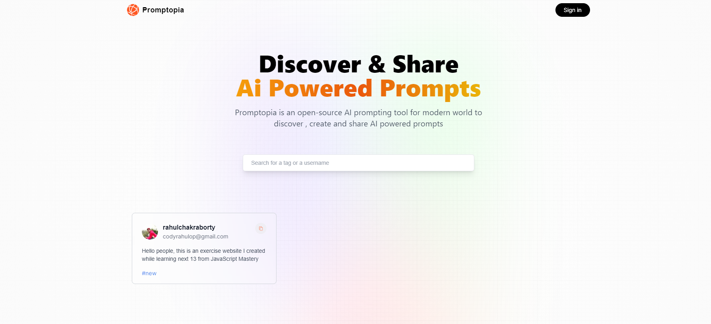

# Promptopia

This is a learning exercise Project I created while learning next.js 13 with Javascript Mastery.


## Acknowledgements

 - [JavaScriptMastery](https://www.youtube.com/c/JavaScriptMastery)
 - [rahulc0dy](https://github.com/rahulc0dy)


## Screenshots




## Features

- Sign In/Out using google
- Create posts
- Delete and edit posts
- responsive


## Installation

Install with npm

```bash
  git clone <link copied from project>
  npm install  
  cd promptopia
```
    
## Support

For support, email rahulchakraborty337@gmail.com or join our Discord Server.


## Tech Stack

**Client:** Next,React, Redux, TailwindCSS

**Server:** Next

**Auth:** NextAuth,Outh

